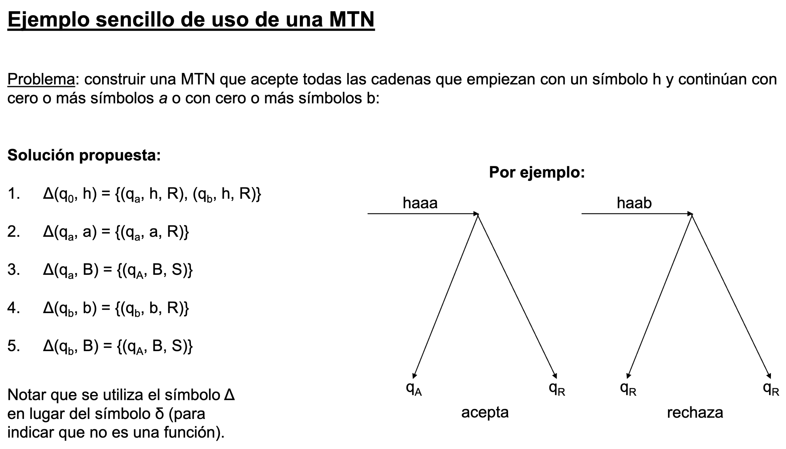

# Trabajo Práctico Nro 1 - La máquina de Turing (MT)

## Conceptos clave para entender mejor la práctica

**Aclaración:** Esta práctica se enfoca en **MTs que resuelven problemas de decisión**.

### ¿Qué es un Lenguaje?

Un **lenguaje** es simplemente un conjunto de cadenas (secuencias de símbolos) que cumplen una regla específica.

**Ejemplo:**

- Alfabeto: Σ = \{a, b\}
- Lenguaje L = \{cadenas que tienen igual cantidad de 'a' y 'b'\}
- Entonces L = \{ab, ba, aabb, abab, baba, ...\}

Un lenguaje es la colección de todas las cadenas que satisfacen esa regla.

### ¿Qué es una Máquina de Turing?

Una **MT es un dispositivo teórico** que:

1. Lee símbolos de una cinta
2. Cambia de estado según lo que lee
3. Escribe símbolos en la cinta
4. Se mueve por la cinta
5. **Acepta o rechaza** la cadena (responde SÍ o NO)

**Visualización simple:**

```
Estado: q0
Cinta: [a][b][a][b][_]
       ↑
```

La MT lee, decide qué hacer, se mueve, y eventualmente acepta o rechaza.

### ¿Cómo una MT "resuelve" un Problema?

La MT acepta exactamente las cadenas que pertenecen al lenguaje:

**Ejemplo:**

- **Problema:** "¿Esta cadena tiene igual cantidad de 'a' y 'b'?"
- **MT:** Lee la cadena y dice SÍ (acepta) o NO (rechaza)
- **Lenguaje L(M):** El conjunto de todas las cadenas que la MT acepta

Por eso: **problema = lenguaje**. Son dos formas de decir lo mismo.

**Otra forma de interpretarlo:** La MT es como un verificador automático que lee una entrada y decide si pertenece o no a un lenguaje específico.

---

## Ejercicio 1. Responder breve y claramente los siguientes incisos:

### 1. ¿En qué se diferencia un problema de búsqueda de un problema de decisión?

Un problema de búsqueda es aquel para el cual existe una MT la cual pueda retornar una solución (podría existir mas de una) y pueda retornar NO en caso de que no exista.

Un problema de decisión es aquel para el cual existe una máquina de turing que responde SI o NO

### 2. ¿Por qué en el caso de los problemas de decisión, podemos referirnos indistintamente a problemas y lenguajes?

Una MT que resuelve un problema de decisión acepta exactamente las cadenas que satisfacen el problema. El lenguaje L(M) que acepta es el conjunto de soluciones del problema, por eso problema y lenguaje son lo mismo.

La idea central es: problema de decisión = lenguaje que reconoce la MT que lo resuelve. Son dos formas de ver lo mismo.

### 3. El problema de satisfactibilidad de las fórmulas booleanas, en su forma de decisión, es: “Dada una fórmula φ, ¿existe una asignación A de valores de verdad que la hace verdadera?” Enunciar el problema de búsqueda asociado.

Dada una fórmula booleana φ, encuentre una asignación A de valores de verdad que haga verdadera la fórmula φ, o retorne NO si no existe tal asignación.

### 4. Otra visión de MT es la que genera un lenguaje (visión generadora). En el caso del problema del inciso anterior, ¿qué lenguaje generaría la MT de visión generadora que resuelve el problema?

Una MT de visión generadora es aquella que genera (produce) cadenas de un lenguaje, en lugar de solo reconocerlas. Es decir, explícitamente produce todas las cadenas que pertenecen a un lenguaje.

Una MT generadora para ese problema generaría el lenguaje:

$L(M) = \{A₁, A₂, A₃, ... | cada Aᵢ es una asignación de valores de verdad que hace verdadera la fórmula φ\}$

El lenguaje L(M) está formado por todas las asignaciones de valores de verdad que satisfacen la fórmula φ, generadas secuencialmente.

**Ejemplo**: Si $φ = (x ∨ ¬y)$:

Genera: $(x=T,y=T)$, $(x=T,y=F)$, $(x=F,y=F)$, ... (todas las asignaciones excepto $x=F,y=T$)

### 5. ¿Qué postula la Tesis de Church-Turing?

La tesis de Church-Turing afirma que todo problema computable se puede resolver con una máquina de Turing.

### 6. ¿Cuándo dos MT son equivalentes? ¿Y cuándo dos modelos de MT son equivalentes?

Dos MT son equivalentes cuando reconocen el mismo lenguaje. Dos modelos de MT son equivalentes si, dada una MT de un modelo, existe una MT equivalente en el otro modelo.

**Explicación con ejemplos:**

- **Dos MTs equivalentes:** Una MT M₁ que acepta $\{a^n b^n | n ≥ 0\}$ y una MT M₂ que también acepta $\{a^n b^n | n ≥ 0\}$ son equivalentes, aunque usen estrategias diferentes. Ambas reconocen el mismo lenguaje.

- **Dos modelos equivalentes:** Una MT determinística (MTD) de 1 cinta y una MT no determinística (MTN) de 2 cintas son modelos equivalentes porque cualquier lenguaje que reconozca una MTN puede ser reconocido por una MTD equivalente (posiblemente con más pasos).

---

## Ejercicio 2. Dado el alfabeto $Ʃ = \{0, 1\}$:

### 1. Obtener el conjunto Ʃ* y el lenguaje incluido en Ʃ* con cadenas de a lo sumo 2 símbolos.

$Ʃ\* = \{&lambda;, 0, 1, 00, 01, 10, 11\}$

### 2. Sea el lenguaje $L = \{0^n 1^n | n ≥ 0\}$. Obtener los lenguajes $Ʃ^* ⋂ L$, $Ʃ^* ⋃ L$ y $L^C$ respecto de $Ʃ^*$.

- $Ʃ^* ⋂ L = L$

- $Ʃ^* ⋃ L = Ʃ^*$

- $L^C$ respecto de $Ʃ^*$ => $L^C = Ʃ^* - L = \{w \in Ʃ^* | w \notin L\}$. Es decir, el complemento de L contiene **todas las cadenas de 0s y 1s que NO tienen la forma $0^n 1^n$**.

---

## Ejercicio 3. En clase se mostró una MT no determinística (MTN) que acepta las cadenas de la forma $ha^n$ o $hb^n$, con $n ≥ 0$. Construir (describir la función de transición) una MT determinística (MTD) equivalente.

### Ejemplo de la clase:



### Idea de la solución:

Una MTD equivalente **decide en cuál rama ir basándose en el primer símbolo después de 'h'**:

1. Lee 'h'
2. **Define la rama según el primer símbolo:**
    - Si es 'a' → Rama A: verifica que el resto sean solo 'a's
    - Si es 'b' → Rama B: verifica que el resto sean solo 'b's
    - Si es Blank (cadena = solo "h") → **ACEPTA** (válido para ambas ramas con n=0)
    - Si es otro símbolo → **RECHAZA**
3. En cada rama, rechaza **inmediatamente** si encuentra cualquier otro símbolo

### Función de transición de la MTD:

**Estados:** $q_0$ (inicial), $q_1$ (después de leer h), $q_a$ (rama a), $q_b$ (rama b), $q_A$ (aceptación), $q_R$ (rechazo)

**Transiciones:**

1. $\delta(q_0, h) = (q_1, h, R)$ — Lee 'h', avanza
2. $\delta(q_1, a) = (q_a, a, R)$ — Primer símbolo es 'a' → entra a rama A
3. $\delta(q_1, b) = (q_b, b, R)$ — Primer símbolo es 'b' → entra a rama B
4. $\delta(q_1, B) = (q_A, B, S)$ — Solo 'h', sin más símbolos → **ACEPTA** (es $ha^0$ o $hb^0$)
5. $\delta(q_a, a) = (q_a, a, R)$ — Rama A: sigue leyendo 'a's
6. $\delta(q_a, B) = (q_A, B, S)$ — Rama A: fin de cinta con solo 'a's → **ACEPTA**
7. $\delta(q_a, b) = (q_R, b, S)$ — Rama A: encontró 'b' → **RECHAZA DIRECTO**
8. $\delta(q_a, *) = (q_R, *, S)$ — Rama A: otro símbolo → **RECHAZA**
9. $\delta(q_b, b) = (q_b, b, R)$ — Rama B: sigue leyendo 'b's
10. $\delta(q_b, B) = (q_A, B, S)$ — Rama B: fin de cinta con solo 'b's → **ACEPTA**
11. $\delta(q_b, a) = (q_R, a, S)$ — Rama B: encontró 'a' → **RECHAZA DIRECTO**
12. $\delta(q_b, *) = (q_R, *, S)$ — Rama B: otro símbolo → **RECHAZA**
13. $\delta(q_0, *) = (q_R, *, S)$ — No empieza con 'h' → **RECHAZA**

### Aclaraciones a tener en cuenta sobre de este ejercicio y las MTN en general:

#### Definición de una **rama** en este contexto

Una **rama** es una posible computación o ejecución que la máquina puede tomar. En la MTN original, cuando llega a $q_0$ y lee 'h', puede bifurcarse en dos ramas:

- **Rama A**: Va a estado $q_a$ para leer ceros o más 'a's
- **Rama B**: Va a estado $q_b$ para leer ceros o más 'b's

La MTN explora **ambas ramas simultáneamente** (gracias al no determinismo). La MTD las simula **secuencialmente**: primero rama A completa, si falla regresa y prueba rama B.

#### ¿Qué es una Máquina de Turing no determinística (MTN)?

Una MTN es una máquina que puede tener **múltiples transiciones posibles** para el mismo par (estado, símbolo). Formalmente:

- En MTD: $\delta(q, a) = (q', b, d)$ → **una transición única**
- En MTN: $\Delta(q, a) = \{(q_1, b_1, d_1), (q_2, b_2, d_2), ...\}$ → **múltiples transiciones**

**Acepta una cadena si AL MENOS UNA rama la acepta.**

#### ¿Por qué las MTN no son físicamente realizables?

Porque necesitarían **procesadores paralelos infinitos**:

1. La MTN explora todas las ramas **simultáneamente** (imposible en realidad)
2. Si hay $c$ opciones en un punto, necesitarías $c$ procesadores diferentes
3. Si hay bifurcaciones exponenciales, necesitarías $2^n$ procesadores

Por eso el PDF dice: _"Las MTN no modelizan una computadora (haría falta un sinnúmero de procesadores). No son físicamente realizables. Sirven para simplificar las descripciones de las MT determinísticas."_

---

## Ejercicio 4. Describir la idea general de una MT con varias cintas que acepte, de la manera más eficiente posible (menor cantidad de pasos), el lenguaje $L = \{a^n b^n c^n | n ≥ 0\}$.

### Idea de la solución:

**Estructura de cintas:**

- **Cinta 1 (entrada)**: Contiene la cadena $a^n b^n c^n$
- **Cinta 2**: Inicialmente B (blank). Escribimos 'a' cada vez que encontramos una 'a' en cinta 1
- **Cinta 3**: Inicialmente B. Escribimos 'b' cada vez que encontramos una 'b' en cinta 1
- **Cinta 4**: Inicialmente B. Escribimos 'c' cada vez que encontramos una 'c' en cinta 1

### Algoritmo eficiente:

Se hace una **única pasada simultánea** en lugar de múltiples pasadas.

1. **Inicialmente**: Las cintas 2, 3, 4 contienen solo B (blanco)

2. **Recorrida única**: Avanza sobre la cinta 1:
    - Cada vez que lee una 'a': escribe 'a' en cinta 2 (avanza puntero cinta 2)
    - Cada vez que lee una 'b': escribe 'b' en cinta 3 (avanza puntero cinta 3)
    - Cada vez que lee una 'c': escribe 'c' en cinta 4 (avanza puntero cinta 4)

3. **Verificación de orden**:
    - Verifica que las 'a's aparezcan antes que las 'b's
    - Las 'b's aparezcan antes que las 'c's
    - **(Rechaza si el orden es incorrecto, ej: "aba...")**

4. **Verificación de cantidad**:
    - Cuando termina la cinta 1 (lee B), compara los contadores de las 3 cintas
    - Si todos tienen la misma cantidad de símbolos → **ACEPTA**
    - Si difieren → **RECHAZA**

### Ejemplo con entrada "aabbcc":

| Paso | Cinta 1     | Cinta 2 | Cinta 3 | Cinta 4 | Acción                                      |
| ---- | ----------- | ------- | ------- | ------- | ------------------------------------------- |
| 1    | **a**abbcc  | a       | B       | B       | Lee 'a', escribe 'a' en cinta 2             |
| 2    | a**a**bbcc  | aa      | B       | B       | Lee 'a', escribe 'a' en cinta 2             |
| 3    | aa**b**bcc  | aa      | b       | B       | Lee 'b', escribe 'b' en cinta 3             |
| 4    | aab**b**cc  | aa      | bb      | B       | Lee 'b', escribe 'b' en cinta 3             |
| 5    | aabb**c**c  | aa      | bb      | c       | Lee 'c', escribe 'c' en cinta 4             |
| 6    | aabbc**c**  | aa      | bb      | cc      | Lee 'c', escribe 'c' en cinta 4             |
| 7    | aabbcc**B** | aa      | bb      | cc      | Lee B, todas tienen 2 símbolos → **ACEPTA** |

### Verificación de cantidad igual:

Después de terminar la cinta 1, la MT realiza una **verificación sincronizada borrando hacia atrás**:

1. Regresa a los inicios de las cintas 2, 3, 4
2. **Borra (convierte a B) simultáneamente** un símbolo de cada cinta en cada paso
3. Si **todas alcanzan B exactamente al mismo tiempo** → cantidades iguales → **ACEPTA**
4. Si **alguna llega a B antes** que las otras → cantidades distintas → **RECHAZA**

**Ejemplo de rechazo**: Si la entrada fuera "aaabbc":

- Cinta 2: aaa (3 símbolos)
- Cinta 3: bb (2 símbolos)
- Cinta 4: c (1 símbolo)

Al borrar sincronizadamente:

- Paso 1: Cinta 2 → aa, Cinta 3 → b, Cinta 4 → B (cinta 4 llega a B primero)
- Resultado: **RECHAZA**, porque no todas tienen igual cantidad

## Ejercicio 5. Explicar cómo una MT sin el movimiento S (el no movimiento) puede simular (ejecutar) otra que sí lo tiene.

Una MT sin el movimiento S (stay/quedarse quieto) puede simular este comportamiento **anulando el movimiento neto**:

Cuando una MT con S necesita quedarse quieta en una posición, una MT sin S puede:

1. **Avanzar derecha (R)** en un paso
2. **Retroceder izquierda (L)** en el siguiente paso

O equivalentemente: L seguido de R.

**Resultado**: La cabeza lectora vuelve a su posición original, simulando efectivamente un movimiento S.

### Ejemplo:

Si la transición original es $\delta(q, a) = (q', a, S)$ (lee 'a', escribe 'a', queda quieto), se reemplaza por dos transiciones intermedias:

- $\delta(q, a) = (q_{\text{temp}}, a, R)$ — Escribe 'a' y avanza derecha a estado temporal
- $\delta(q_{\text{temp}}, \sigma) = (q', \sigma, L)$ — Lee cualquier símbolo $\sigma$, lo deja igual, retrocede izquierda

De esta forma, el neto de movimientos es cero, equivalente al movimiento S original.

---

## Ejercicio 6. En clase se construyó una MT con 2 cintas que acepta $L = \{w | w ∈ \{a, b\}^* y w es un palíndromo\}$. Construir una MT equivalente con 1 cinta. Ayuda: la solución que vimos para aceptar el lenguaje de las cadenas $a^n b^n$, con $n ≥ 1$, puede ser un buen punto de partida.

---

## Ejercicio 7. Construir una MT que calcule la resta de dos números. Ayuda: se puede considerar la idea de solución propuesta en clase.

---

## Ejercicio 8. Construir una MT que genere todas las cadenas de la forma anbn, con $n ≥ 1$. Ayuda: se puede considerar la idea de solución propuesta en clase.
